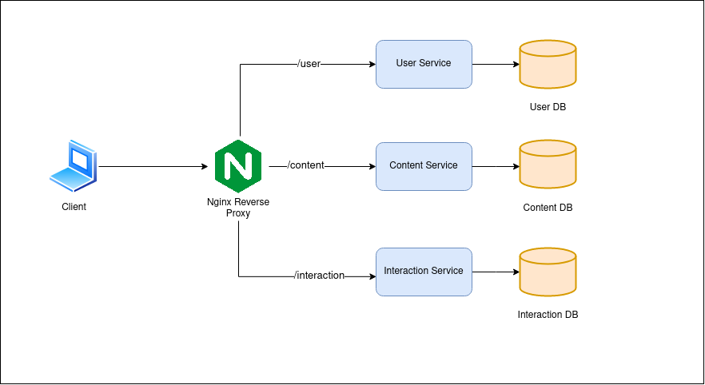

# High-Level Design Document: Online Content Microservice Project

## Table of Contents
- [High-Level Design Document: Online Content Microservice Project](#high-level-design-document-online-content-microservice-project)
  - [Table of Contents](#table-of-contents)
  - [1. Introduction](#1-introduction)
  - [2. Architecture Overview](#2-architecture-overview)
  - [3. Microservices](#3-microservices)
    - [a. Content Service](#a-content-service)
    - [b. User Interaction Service](#b-user-interaction-service)
    - [c. User Service](#c-user-service)
  - [4. Technologies and Tools](#4-technologies-and-tools)
  - [5. Database Design](#5-database-design)
  - [6. API Design](#6-api-design)
  - [7. Dockerization](#7-dockerization)

## 1. Introduction
The Online Content Microservice Project aims to build three microservices to manage content, user interactions, and user data. The project follows the microservices architecture and uses Docker for containerization. Each microservice has its own dedicated database.

## 2. Architecture Overview

The architecture comprises one proxy server and three microservices. The proxy server is responsible for routing requests to the appropriate microservice. The proxy server is implemented using **Nginx**.

The database is implemented using **MongoDB**. Each microservice has its own dedicated database. The databases are containerized using Docker.

The three microservices are:
- **Content Service**: Responsible for managing content, including books, and provides CRUD operations for content, new content listings, and top content listings based on user interactions.
- **User Interaction Service**: Records user interactions "Like" and "Read" events and APIs to manage these events. It also exposes internal APIs to facilitate content sorting based on interactions.
- **User Service**: Manages user data and offers CRUD operations for user profiles.

## 3. Microservices

### a. Content Service
**Key Features:**
- Ingests data from CSV files.
- Stores content details including title, story, date published, and user ID.
- Provides RESTful APIs for CRUD operations on content.
- Offers an API for listing new contents sorted by date.
- Offers an API for listing top contents sorted by the number of interactions (likes and reads).

### b. User Interaction Service
**Key Features:**
- Records "Like" and "Read" events for content.
- Provides APIs to record and read these interactions.
- Exposes internal APIs for content service to sort content based on user interactions.

### c. User Service
**Key Features:**
- Manages user profiles.
- Provides RESTful APIs for CRUD operations on users, including first name, last name, email, and phone number.
- Provide authentication token to users.

## 4. Technologies and Tools
- Language: Node.js (Express.js), TypeScript
- Databases: Docker Containerized MongoDB instance with separate databases for each microservice
- Docker for containerization
- Swagger for documentation
- Postman collection to test apis

## 5. Database Design
Each microservice uses its own dedicated database. Database schema design for each microservice will be detailed in the Low-Level Design (LLD).

## 6. API Design
API design for each microservice will be detailed in the Low-Level Design (LLD). Conventions for RESTful endpoints and data formats will be followed.

## 7. Dockerization
- Docker Compose is used for managing multiple services including Nginx and MongoDB.
- Instructions for building and running the Dockerized applications are provided in the README.md file at the root of repository.
